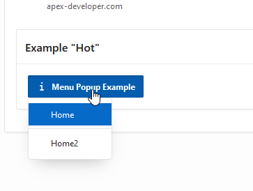
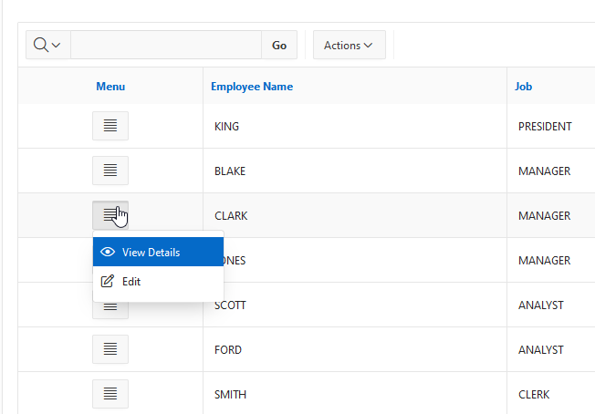
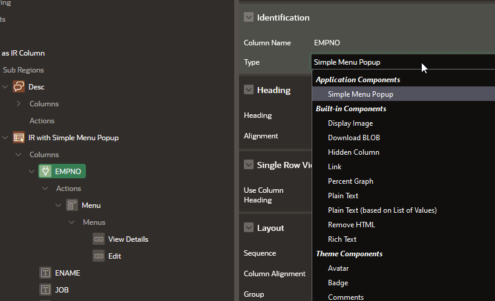
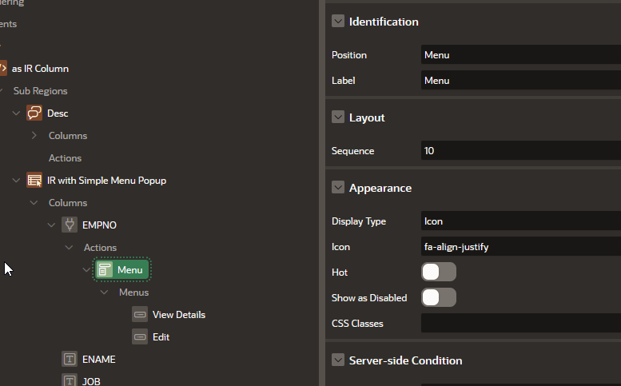

# APEX Template Component - Simple Menu Popup
Get a menu popup as an IR column or region in Oracle APEX. It is very simple, but you can do it declaratively. It uses 

#### as Region:

#### as IR Column:

## How to Install
- Download the plug-in file from the latest release
- Import the plug-in file into your application
## How to Setup as IR Column
- Set IR Column to type "Simple Menu Popup"
- Add Actions to generate the Menu structure
## How to Setup as Region
- Create a region "Simple Menu Popup"
- Set dummy Query like `select 1 dummy from dual`
- Configure actions to generate the Menu Popup

## Config Options
#### Column Type

#### Styling

